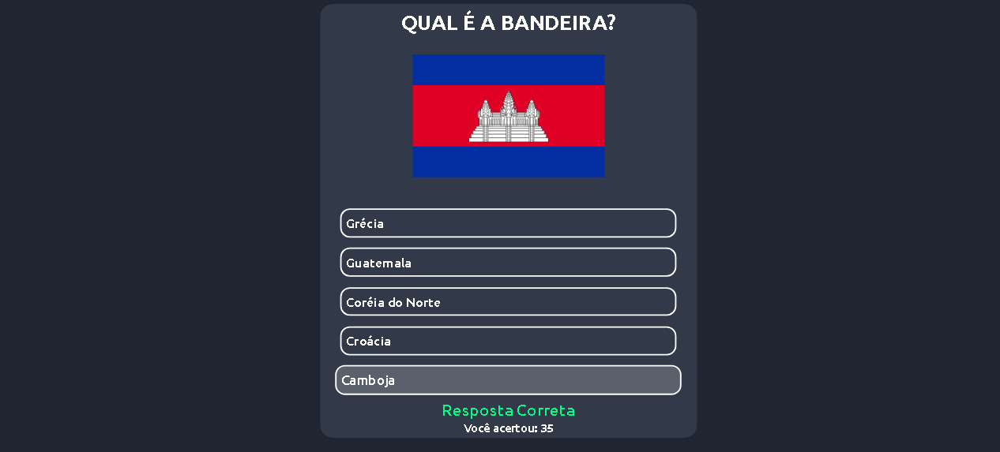

# QuizFlags

Projeto de um Quiz responsivo sobre bandeiras, contendo no total 257 bandeiras diferentes para o usuário poder se divertir tentando acertar as mesmas. Projeto feito em HTML, CSS e JavaScript, com opção de escolha de dificuldade, contagem de pontos e pontuação final

[Link da Página](https://nathanrigolei.github.io/QuizFlags/)

